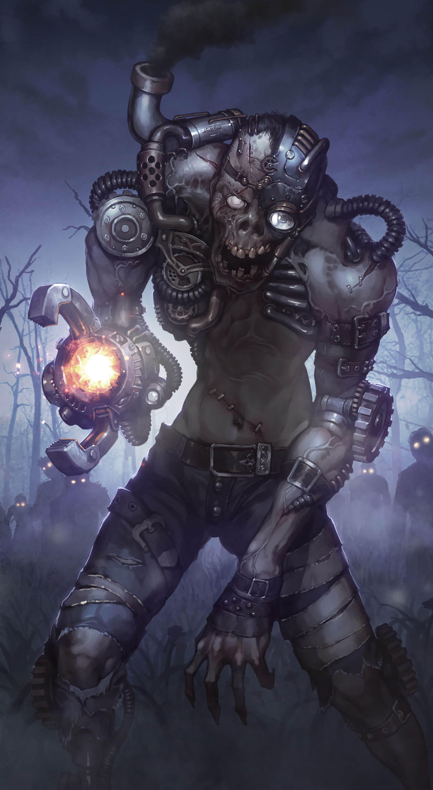
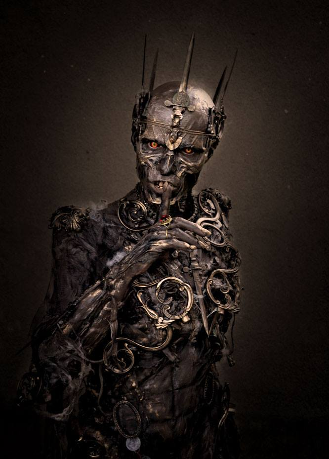

# __Mindless Corpsewalker__

## __Description__
The Mindless Corpsewalker is a standard minion type that can be summoned to the field to push out quick damage at a cheap cost. These specific types of minions are so modified beyond the standard follower that they cannot be sacrificed for souls. Corpsewalkers have been modified with engineering contraptions across their bodies to become much more powerful fighters on the battlefield. Apply this process has a great effect on tearing apart their souls from the etheral plane.

## __Card Effects__
- 50% chance that this minion will miss the target when attacking
- Cannot be ___sacrificed___

## __Flavour Text__
_"He draws closer. Thud. Thud. Thud... My heart beats faster; mindless as he moves, slow and docile, but, always drawing nearer. He can smell my fear and I lose concious for but a second. And then it happens, he wraps his putrid hand around my neck, and the world stops. I draw my final breath..."_ - Unknown Civilian, 1854 AD

## __Attributes Table__
| Health  | Damage  | Leeching | Souls | Type         | Archetypes |
|---------|---------|----------|-------|--------------|------------|
| 1       | 2       | 0        | 0     | (N)ecromancy | Undead     |

[Game Card Catalog](../../04_game_card_catalog.md)  
[Table of Contents](01_table_of_contents.md)
