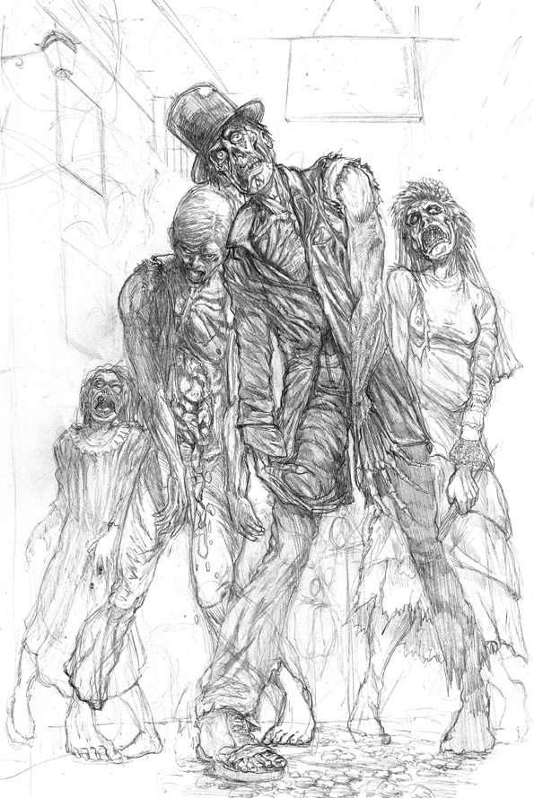
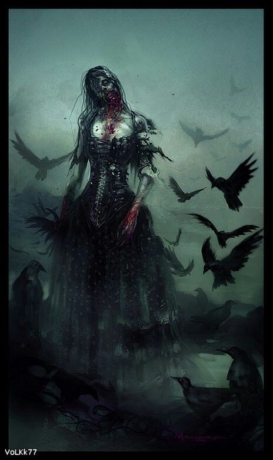

# __Minion__

## __Description__
Minions are zombified creatures that carry out your bidding. They are single cost and single damage monsters based on the Undead archetype and can be sacrificed to summon demons onto the playing field. They are largely disposable and you can carry as many of them in your deck as you wish.

## __Card Effects__
N/A

## __Flavour Text__
_"Dear Eliza - I write hoping this letter finds you well. We have finally made it to the foothold of these damned monsters that plague the lands around us. We believe this is the source of them, however, I worry once this fight is over I'll never see you again. If I don't make it back do not forget us and what we have sacrificed. Until the burning sun rises across the peaks and we meet again, on this earth, or the next..."_ - Damien Paxley, Footsoldier, 1867 AD

## __Attributes Table__
| Health  | Damage  | Leeching | Souls | Type         | Archetypes |
|---------|---------|----------|-------|--------------|------------|
| 1       | 1       | 0        | 0     | (N)ecromancy | Undead     |

[Game Card Catalog](../../04_game_card_catalog.md)  
[Table of Contents](../../01_table_of_contents.md)
