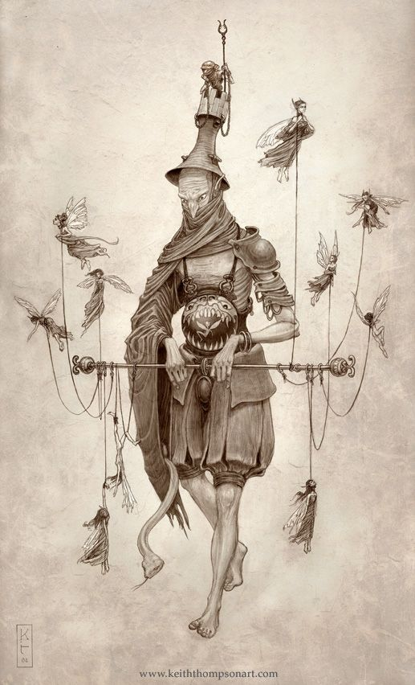
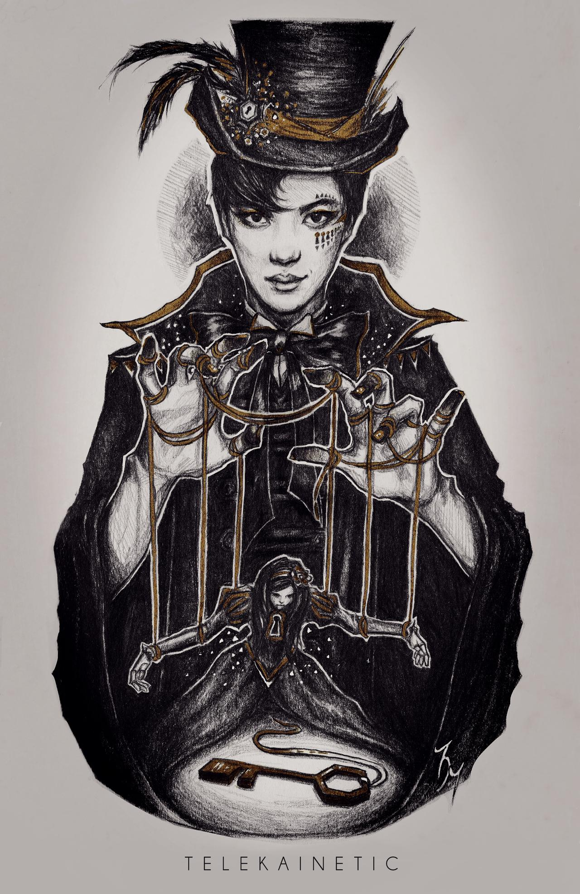

# __The Puppeteer__

## __Description__
Summons the puppeteer to execute your command against the targeted minion. Once he has passed control of the targeted minion to you he vanishes.

## __Card Effects__
- __Destroy__ any card that is currently active on your board and select an opposing minion that is a range of +/- 2 health from your minion to take control of.
- The targeted minion will not trigger any effects set to be activated on death

## __Flavour Text__
_"Like a crack ripping through the sound of the battlefield. I cackle, I scream with glee, another victim beset before me. A whip of my strings, a lash to the face, wrapped around your neck - your soul I will take. One more giggle, a flick of my wrist, a pull on the string, and off we go, into the mist!"_ - ___A Pulling of Strings___ by The Puppeteer, 1830 AD

## __Attributes Table__
| Health  | Damage  | Leeching | Souls | Type            | Archetypes |
|---------|---------|----------|-------|-----------------|------------|
| 0       | 0       | 0        | 0     | (T)ransmutation |  N/A       |

[Game Card Catalog](../../04_game_card_catalog.md)  
[Table of Contents](../../01_table_of_contents.md)
